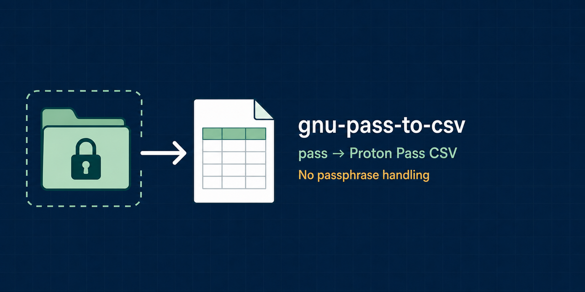

# GNU pass to CSV

**Move login entries from `pass` to Proton Pass without giving this tool your GPG passphrase.**

GNU pass to CSV is a local command-line exporter for the standard Unix
[`pass`](https://www.passwordstore.org/) password manager. It asks `pass` to
decrypt each entry through your existing `gpg-agent`, maps common fields, and
writes a deterministic CSV for Proton Pass's generic CSV importer.



!!! danger "The export is plaintext"

    The generated CSV contains every exported password in plaintext. Write it
    to a local, non-synced directory on an encrypted filesystem, import it
    promptly, verify the result, and then remove it. Never commit, sync, email,
    or open the export in an online spreadsheet.

## What it preserves

- Nested entry names such as `Work/example.com/alice`.
- URL, email, username, note, and TOTP fields from common `pass` entry layouts.
- A chosen Proton Pass vault name for every exported row.
- Stable UTF-8 output with private `0600` permissions on POSIX systems.

## Safety boundary

- The exporter never asks for or accepts a GPG passphrase.
- Decryption is delegated to the fixed command `pass show -- <entry>` without a shell.
- There is no network code, telemetry, configuration loader, or runtime Python dependency.
- A failed entry aborts the export before the destination is created unless
  `--skip-errors` is explicitly selected.
- Existing files are protected unless `--force` is explicitly selected.
- Plaintext output inside the encrypted password store is refused.

## How it fits together

```text
password-store paths ──> pass show ──> field parser ──> atomic CSV writer
      encrypted           gpg-agent      process memory       mode 0600
```

## Start here

1. Follow [Getting started](getting-started.md) for a complete migration.
2. Review the [command reference](usage.md) before changing safe defaults.
3. Check [entry mapping](entry-mapping.md) against a synthetic example shaped
   like your store.
4. Read the [security model](security.md) before creating the plaintext export.
5. Use [Troubleshooting](troubleshooting.md) if `pass`, GPG, or the import fails.

The current stable version is
[v2.0.0](https://github.com/fbossiere/gnu-pass-to-csv/releases/tag/v2.0.0).
This independent project is not affiliated with, sponsored by, or endorsed by
Proton AG or the password-store project.
